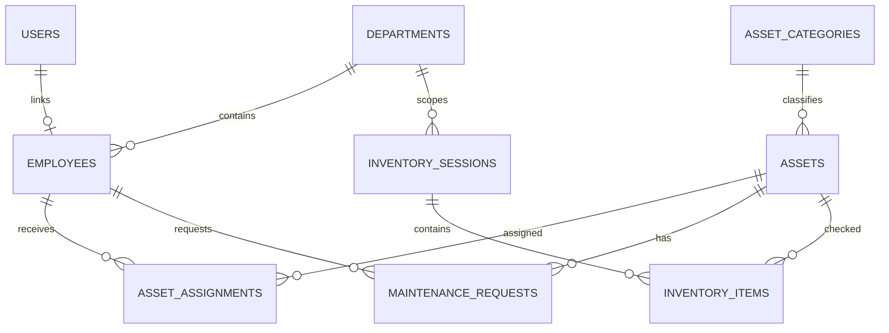
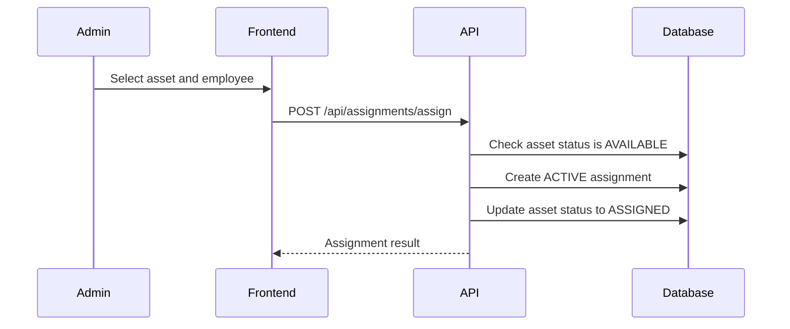
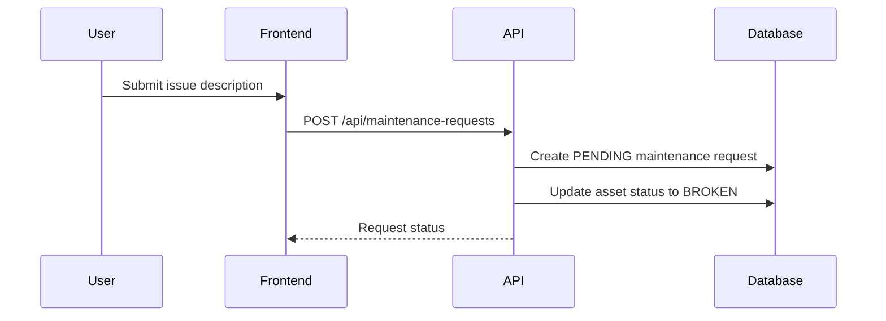
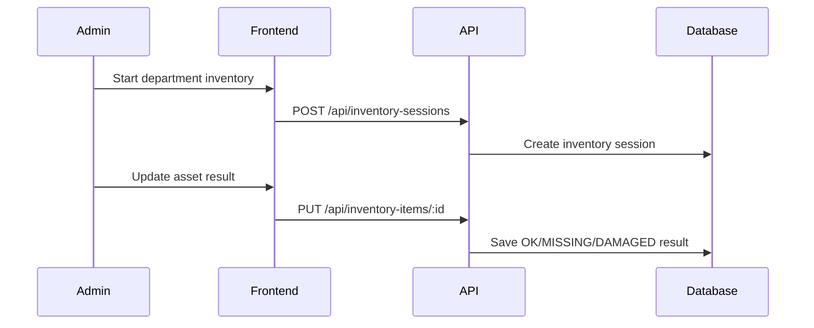

# Technical Design Document: Enterprise Asset Management MVP

## 1. Overview

This document defines the MVP design for a web-based Enterprise Asset Management system built as an internship project by a 5-person team over 5 weeks.

The system helps a company manage assets, categories, employees, departments, asset allocation, maintenance requests, simple inventory checks, and summary reports. The project must run locally with MySQL through XAMPP and be deployed to AWS using 3-5 AWS services.

## 2. Requirements

### 2.1 Functional Requirements

- Admin users can manage assets, asset categories, employees, and departments.
- Admin users can assign assets to employees, recall assets, transfer assets, and view allocation history.
- Admin users can receive and update maintenance requests, including status and repair cost.
- Admin users can create simple inventory sessions and update inventory results by department.
- Admin users can view summary reports for total assets, total asset value, assets by category, assets by department, broken assets, and assets under maintenance.
- Employee users can view personal profile information.
- Employee users can view assigned assets and asset details.
- Employee users can report broken assets and track maintenance request status.
- Employee users can view their allocation and maintenance history.

### 2.2 Non-Functional Requirements

- The MVP must be feasible for 5 people over 5 weeks.
- The application must support local development with XAMPP MySQL.
- The production deployment must use AWS RDS MySQL.
- The system must use JWT authentication and role-based access control for `ADMIN` and `USER`.
- Backend APIs must validate request payloads and return consistent error responses.
- The UI must be simple, operational, and easy to demo.
- The deployment must use 3-5 AWS services and include basic logging/monitoring.

## 3. Technical Design

### 3.1 Architecture

The application is split into three main layers:

- React frontend for admin and employee screens.
- Node.js/Express backend exposing REST APIs.
- MySQL database for users, employees, assets, assignments, maintenance, inventory, and reporting data.

Local development uses XAMPP MySQL. Production uses AWS RDS MySQL with the same schema.

Recommended AWS services:

- AWS RDS MySQL for the production database.
- AWS S3 for asset images or document uploads.
- AWS EC2 or Elastic Beanstalk for the Express backend.
- AWS Amplify or S3 plus CloudFront for the React frontend.
- AWS CloudWatch for backend logs and basic monitoring.

### 3.2 MVP Modules

- Auth and role management: login, current user, change password, admin/user route protection.
- Asset management: create, update, delete, search, categorize, view details, manage status.
- Category management: CRUD for asset categories such as laptop, printer, projector, desk, and chair.
- Employee management: CRUD for employee records.
- Department management: CRUD for departments.
- Allocation management: assign, recall, transfer assets, and view allocation history.
- Maintenance management: employee reports broken asset, admin updates status, cost, and history.
- Inventory management: create inventory session, check assets by department, record result.
- Reporting: summary cards and basic charts/tables for key asset metrics.

### 3.3 Data Model

Core tables:

- `users`: login account, password hash, role, linked employee.
- `employees`: employee code, full name, email, phone, department.
- `departments`: department name and description.
- `asset_categories`: category name and description.
- `assets`: asset code, name, category, serial number, purchase date, value, status, image, notes.
- `asset_assignments`: asset, assigned employee, assigned date, returned date, assignment status, notes.
- `maintenance_requests`: asset, requester, issue description, status, repair cost, resolution notes.
- `inventory_sessions`: inventory name, department, start date, end date, status.
- `inventory_items`: inventory session, asset, result, notes.

Suggested ERD:

### 3.4 Business States

Asset statuses:

- `AVAILABLE`: asset is ready to assign.
- `ASSIGNED`: asset is currently assigned to an employee.
- `MAINTENANCE`: asset is being repaired.
- `BROKEN`: asset is reported broken.
- `LOST`: asset is missing.
- `DISPOSED`: asset is no longer used.

Assignment statuses:

- `ACTIVE`: asset is currently assigned.
- `RETURNED`: asset was recalled.
- `TRANSFERRED`: asset was transferred to another employee.

Maintenance statuses:

- `PENDING`: request was created and is waiting for admin handling.
- `IN_PROGRESS`: repair is being processed.
- `COMPLETED`: repair is completed.
- `CANCELLED`: request was cancelled.

Inventory session statuses:

- `DRAFT`: inventory session was created but not started.
- `IN_PROGRESS`: inventory checking is active.
- `COMPLETED`: inventory session is finished.

Inventory item results:

- `OK`: asset exists and is in acceptable condition.
- `MISSING`: asset is missing.
- `DAMAGED`: asset is damaged.

### 3.5 API Changes

Auth:

- `POST /api/auth/login`
- `GET /api/auth/me`
- `PUT /api/auth/change-password`

Assets:

- `GET /api/assets`
- `POST /api/assets`
- `GET /api/assets/:id`
- `PUT /api/assets/:id`
- `DELETE /api/assets/:id`

Categories:

- `GET /api/categories`
- `POST /api/categories`
- `PUT /api/categories/:id`
- `DELETE /api/categories/:id`

Employees:

- `GET /api/employees`
- `POST /api/employees`
- `PUT /api/employees/:id`
- `DELETE /api/employees/:id`

Departments:

- `GET /api/departments`
- `POST /api/departments`
- `PUT /api/departments/:id`
- `DELETE /api/departments/:id`

Assignments:

- `POST /api/assignments/assign`
- `POST /api/assignments/return`
- `POST /api/assignments/transfer`
- `GET /api/assignments/history`

Maintenance:

- `GET /api/maintenance-requests`
- `POST /api/maintenance-requests`
- `GET /api/maintenance-requests/:id`
- `PUT /api/maintenance-requests/:id/status`

Inventory:

- `GET /api/inventory-sessions`
- `POST /api/inventory-sessions`
- `GET /api/inventory-sessions/:id`
- `PUT /api/inventory-items/:id`

Reports:

- `GET /api/reports/summary`
- `GET /api/reports/assets-by-category`
- `GET /api/reports/assets-by-department`

### 3.6 UI Design

Admin screens:

- Login page.
- Admin dashboard with summary metrics.
- Asset list, asset detail, create/edit asset form.
- Category management.
- Employee management.
- Department management.
- Assignment workflow screens.
- Maintenance request list and detail.
- Inventory session list and detail.
- Reports page.

Employee screens:

- Profile page.
- Assigned asset list.
- Asset detail page.
- Report broken asset form.
- Maintenance request tracking.
- Allocation and maintenance history.

### 3.7 Logic Flow

Assign asset:

Report broken asset:

Inventory check:

## 4. Team Plan

This project should be split by ownership, not by isolated weekly chunks. Each person owns one area from setup to final demo, then coordinates with the others through clear handoff points.

### Person 1: Backend Foundation And Auth

Primary responsibility: build the backend foundation quickly so the rest of the team can plug in feature modules.

Core tasks:

- Set up the `backend/` project with Express.
- Create the backend folder structure: routes, controllers, services, middleware, config, and tests.
- Configure environment variables and MySQL connection.
- Implement shared response and error handling conventions.
- Implement request validation pattern.
- Implement JWT authentication.
- Implement role-based access control for `ADMIN` and `USER`.
- Implement auth APIs:
  - `POST /api/auth/login`
  - `GET /api/auth/me`
  - `PUT /api/auth/change-password`
- Create shared middleware:
  - `authenticate`
  - `authorize`
  - `validateRequest`
  - `errorHandler`
- Create a short backend integration guide for the team.

Handoff to team:

- Backend can run locally.
- Database connection works with XAMPP MySQL.
- Auth APIs work.
- Other backend members know how to register new routes.
- Frontend members know login response shape and how to send JWT token.

### Person 2: Backend Core Management APIs

Primary responsibility: implement the CRUD APIs that all admin screens depend on.

Core tasks:

- Create MySQL tables and service logic for:
  - `departments`
  - `employees`
  - `asset_categories`
  - `assets`
- Implement department APIs:
  - `GET /api/departments`
  - `POST /api/departments`
  - `PUT /api/departments/:id`
  - `DELETE /api/departments/:id`
- Implement employee APIs:
  - `GET /api/employees`
  - `POST /api/employees`
  - `PUT /api/employees/:id`
  - `DELETE /api/employees/:id`
- Implement category APIs:
  - `GET /api/categories`
  - `POST /api/categories`
  - `PUT /api/categories/:id`
  - `DELETE /api/categories/:id`
- Implement asset APIs:
  - `GET /api/assets`
  - `POST /api/assets`
  - `GET /api/assets/:id`
  - `PUT /api/assets/:id`
  - `DELETE /api/assets/:id`
- Add asset filters for category, department, status, keyword, and assigned employee if feasible.
- Maintain asset status rules used by assignment and maintenance modules.

Handoff to team:

- Admin frontend can build CRUD screens against stable APIs.
- Person 3 can use asset, employee, and department data for assignment, maintenance, inventory, and reports.
- Seed data can be created using these tables.

### Person 3: Backend Business Workflows And AWS

Primary responsibility: implement asset lifecycle workflows and handle cloud deployment.

Core tasks:

- Implement assignment APIs:
  - `POST /api/assignments/assign`
  - `POST /api/assignments/return`
  - `POST /api/assignments/transfer`
  - `GET /api/assignments/history`
- Implement maintenance APIs:
  - `GET /api/maintenance-requests`
  - `POST /api/maintenance-requests`
  - `GET /api/maintenance-requests/:id`
  - `PUT /api/maintenance-requests/:id/status`
- Implement inventory APIs:
  - `GET /api/inventory-sessions`
  - `POST /api/inventory-sessions`
  - `GET /api/inventory-sessions/:id`
  - `PUT /api/inventory-items/:id`
- Implement report APIs:
  - `GET /api/reports/summary`
  - `GET /api/reports/assets-by-category`
  - `GET /api/reports/assets-by-department`
- Prepare AWS deployment:
  - RDS MySQL for production database.
  - EC2 or Elastic Beanstalk for backend.
  - S3 for image/document upload if included.
  - CloudWatch for logs.
- Write deployment notes for the team.

Handoff to team:

- Admin frontend can build assignment, maintenance, inventory, and report screens.
- Employee frontend can submit maintenance requests and show request status.
- The team has a working AWS deployment path before the final week.

### Person 4: Frontend Admin

Primary responsibility: build the admin workspace used for management and demo.

Core tasks:

- Set up React app structure and admin routing.
- Build shared UI components:
  - layout
  - sidebar
  - top bar
  - table
  - modal
  - form
  - status badge
- Implement admin screens:
  - Dashboard
  - Asset management
  - Asset category management
  - Employee management
  - Department management
  - Assignment management
  - Maintenance management
  - Inventory management
  - Reports
- Connect admin screens to backend APIs.
- Handle loading, empty, success, and error states.

Handoff to team:

- Admin can perform the main demo flow from the UI.
- Person 5 can reuse shared UI pieces for employee screens.
- Backend team gets quick feedback when API response shapes are hard to use.

### Person 5: Frontend Employee, QA, Seed Data, And Demo

Primary responsibility: build employee-facing screens and make sure the project is demo-ready.

Core tasks:

- Build employee routes and layout.
- Implement employee screens:
  - Profile
  - Change password
  - My assigned assets
  - Asset detail
  - Report broken asset
  - Maintenance request tracking
  - Allocation and maintenance history
- Prepare manual test cases for each critical workflow.
- Prepare seed data:
  - admin account
  - employee accounts
  - departments
  - employees
  - asset categories
  - assets
  - assignments
  - maintenance requests
  - inventory sample data
- Prepare demo script and screenshots.
- Run regression testing before final presentation.

Handoff to team:

- Employee flow is demoable.
- The team has test cases and demo data.
- The final report/presentation has clear screenshots and workflow steps.

## 5. Timeline

The timeline below is ordered by dependency. Person 1 should start first because backend foundation unlocks all backend and frontend integration work. Other members can prepare contracts, UI skeletons, and schema work in parallel, but they should integrate only after Person 1's backend foundation is ready.

### Week 1: Foundation And Contracts

Goal: create the shared foundation so backend and frontend can work in parallel from week 2.

- Person 1: Build backend foundation first: Express app, folder structure, env config, MySQL connection, health check, error handler, auth skeleton, and route registration pattern.
- Person 2: Draft core schema and prepare CRUD API contracts for assets, categories, employees, and departments.
- Person 3: Draft workflow schema and prepare API contracts for assignments, maintenance, inventory, and reports; research AWS service choices.
- Person 4: Set up React app, admin layout, routing, login UI, table/form components, and API client skeleton.
- Person 5: Set up employee layout, QA checklist, seed data plan, and demo script outline.

Deliverables:

- Person 1 hands off a runnable backend foundation.
- API contract draft is ready for frontend/backend alignment.
- Local frontend and backend can run.
- Team has a shared schema direction.

### Week 2: Core Management Features

Goal: complete the core CRUD and login flow.

- Person 1: Finish JWT login, `GET /api/auth/me`, change password, `authenticate`, `authorize`, and request validation pattern.
- Person 2: Implement CRUD APIs for categories, departments, employees, and assets; include search/filter for assets.
- Person 3: Review Person 2's data model for lifecycle compatibility and prepare RDS MySQL setup notes.
- Person 4: Build admin CRUD screens and connect them to Person 2's APIs.
- Person 5: Build employee profile and assigned-asset screen shells; write manual tests for auth and CRUD.

Deliverables:

- Person 1 hands off complete auth/role middleware.
- Person 2 hands off stable core management APIs.
- Person 4 can demo admin CRUD.
- Person 5 has test cases and seed data for core entities.

### Week 3: Asset Lifecycle Features

Goal: complete the main asset lifecycle workflows.

- Person 1: Stabilize protected routes, standardize API errors, and help debug integration issues.
- Person 2: Finalize asset status transitions used by assignment and maintenance workflows.
- Person 3: Implement assignment APIs: assign, return, transfer, and assignment history.
- Person 4: Build admin assignment screens and history view.
- Person 5: Build employee asset detail, report broken asset form, and personal history screen.

Deliverables:

- Person 3 hands off assignment APIs.
- Person 4 can demo admin assignment workflows.
- Person 5 can demo employee asset and report-broken flow.
- The first full admin-to-employee business flow works.

### Week 4: Maintenance, Inventory, Reports, And AWS Trial

Goal: complete remaining MVP modules and deploy a test version to AWS.

- Person 1: Add production config cleanup, logging basics, and backend stability fixes.
- Person 2: Support report queries and fix data consistency issues from integration.
- Person 3: Implement maintenance APIs, inventory APIs, report APIs, and first AWS backend/RDS deployment trial.
- Person 4: Build admin maintenance, inventory, and report screens.
- Person 5: Run full manual QA, finalize seed data, update demo script, and document bugs with reproduction steps.

Deliverables:

- Person 3 hands off maintenance, inventory, report APIs, and AWS trial deployment notes.
- Person 4 can demo maintenance, inventory, and reports from admin UI.
- Person 5 has a prioritized bug list and final demo data.

### Week 5: Final Deployment, QA, And Presentation

Goal: stabilize the project and prepare for internship evaluation.

- Person 1: Fix backend auth/security bugs, verify production env variables, and support final backend deployment.
- Person 2: Fix CRUD/data consistency bugs, prepare final database seed, and verify asset status behavior.
- Person 3: Finalize AWS deployment, verify RDS connection, configure S3 if included, check CloudWatch logs, and write deployment notes.
- Person 4: Polish admin UI, fix layout issues, and verify all admin demo flows.
- Person 5: Finalize employee UI, run regression tests, prepare screenshots, report document, and presentation/demo script.

Deliverables:

- Final AWS deployment is working.
- Admin and employee demo accounts are ready.
- Demo script is complete.
- Manual test checklist is complete.
- Presentation/report materials are ready.

## 6. Testing Plan

- Unit test backend services for auth, asset status changes, assignment workflows, and maintenance status transitions.
- API test key Express endpoints for success and failure cases.
- Manually test admin and employee workflows end to end.
- Test local XAMPP MySQL and AWS RDS MySQL connection separately.
- Test deployed frontend against deployed backend.
- Test role restrictions so employee users cannot access admin APIs.

## 7. Risks And Mitigations

- Scope creep: avoid purchase management, depreciation, multi-level approvals, and advanced audit logging in the MVP.
- Late AWS deployment: create a deployment test by week 3 or early week 4.
- Overly complex data model: keep schema focused on asset lifecycle, assignment history, maintenance, inventory, and reports.
- Frontend/backend mismatch: define API contracts in week 1 and keep request/response shapes stable.
- Weak demo data: prepare seed data with realistic departments, employees, categories, assets, assignments, and maintenance requests.

## 8. MVP Success Criteria

- Admin can manage assets, categories, employees, and departments.
- Admin can assign, recall, transfer assets, and view assignment history.
- Employee users can view assigned assets and report broken assets.
- Admin can process maintenance requests and record repair cost.
- Admin can create a simple inventory session and update asset check results.
- Admin can view basic asset reports.
- The app runs locally with XAMPP MySQL.
- The app is deployed to AWS using RDS MySQL and at least two additional AWS services.
- The team has seed data, demo accounts, documentation, and a presentation script.

## 9. Alternatives Considered

### Smaller MVP

This option includes only auth, asset CRUD, employee CRUD, assignment, and basic dashboard. It has the lowest delivery risk but may feel too simple for an internship project requiring AWS deployment.

### Balanced MVP

This option includes asset management, assignment, maintenance, simple inventory, reports, and AWS deployment. This is the recommended option because it has enough business depth while remaining feasible in 5 weeks.

### Near Full Scope

This option includes full inventory, detailed repair cost management, richer analytics, and more complete asset lifecycle features. It is not recommended for 5 weeks because it increases implementation and testing risk.

## 10. Open Questions

- Choose backend deployment target: AWS EC2 or AWS Elastic Beanstalk.
- Choose frontend deployment target: AWS Amplify or S3 plus CloudFront.
- Confirm whether S3 upload is required for the final demo or can be a stretch feature.
