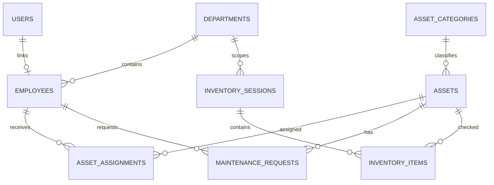
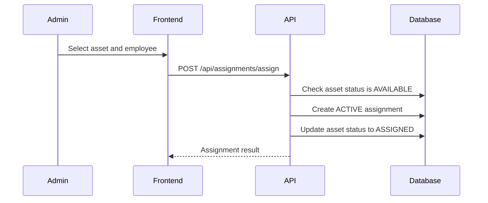
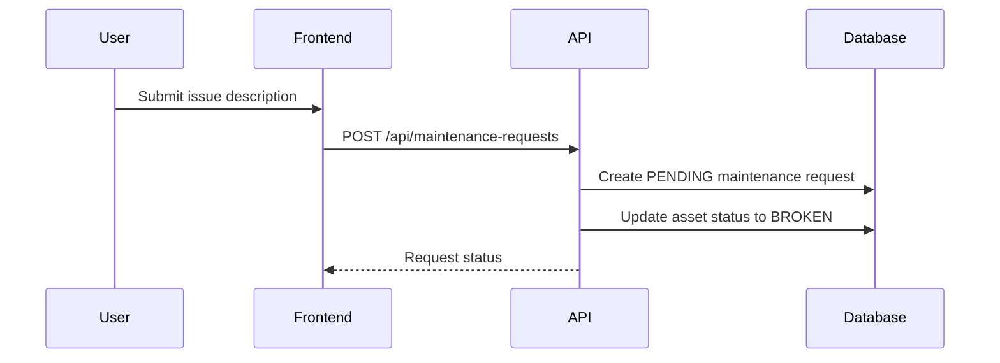
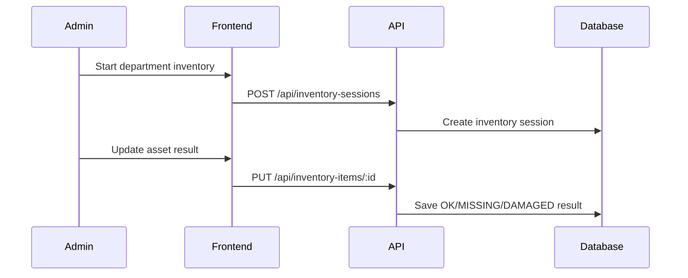

# Technical Design Document: Enterprise Asset Management MVP

## 1. Overview

This document defines the MVP design for a web-based Enterprise Asset Management system built as an internship project by a 5-person team over 5 weeks.

The system helps a company manage assets, categories, employees, departments, asset allocation, maintenance requests, simple inventory checks, and summary reports. The project must run locally with MySQL through XAMPP and be deployed to AWS using 3-5 AWS services.

## 2. Requirements

### 2.1 Functional Requirements

- Admin users can manage assets, asset categories, employees, and departments.
- Admin users can assign assets to employees, recall assets, transfer assets, and view allocation history.
- Admin users can receive and update maintenance requests, including status and repair cost.
- Admin users can create simple inventory sessions and update inventory results by department.
- Admin users can view summary reports for total assets, total asset value, assets by category, assets by department, broken assets, and assets under maintenance.
- Employee users can view personal profile information.
- Employee users can view assigned assets and asset details.
- Employee users can report broken assets and track maintenance request status.
- Employee users can view their allocation and maintenance history.

### 2.2 Non-Functional Requirements

- The MVP must be feasible for 5 people over 5 weeks.
- The application must support local development with XAMPP MySQL.
- The production deployment must use AWS RDS MySQL.
- The system must use JWT authentication and role-based access control for `ADMIN` and `USER`.
- Backend APIs must validate request payloads and return consistent error responses.
- The UI must be simple, operational, and easy to demo.
- The deployment must use 3-5 AWS services and include basic logging/monitoring.

## 3. Technical Design

### 3.1 Architecture

The application is split into three main layers:

- React frontend for admin and employee screens.
- Node.js/Express backend exposing REST APIs.
- MySQL database for users, employees, assets, assignments, maintenance, inventory, and reporting data.

Local development uses XAMPP MySQL. Production uses AWS RDS MySQL with the same schema.

Recommended AWS services:

- AWS RDS MySQL for the production database.
- AWS S3 for asset images or document uploads.
- AWS EC2 or Elastic Beanstalk for the Express backend.
- AWS Amplify or S3 plus CloudFront for the React frontend.
- AWS CloudWatch for backend logs and basic monitoring.

### 3.2 MVP Modules

- Auth and role management: login, current user, change password, admin/user route protection.
- Asset management: create, update, delete, search, categorize, view details, manage status.
- Category management: CRUD for asset categories such as laptop, printer, projector, desk, and chair.
- Employee management: CRUD for employee records.
- Department management: CRUD for departments.
- Allocation management: assign, recall, transfer assets, and view allocation history.
- Maintenance management: employee reports broken asset, admin updates status, cost, and history.
- Inventory management: create inventory session, check assets by department, record result.
- Reporting: summary cards and basic charts/tables for key asset metrics.

### 3.3 Data Model

Core tables:

- `users`: login account, password hash, role, linked employee.
- `employees`: employee code, full name, email, phone, department.
- `departments`: department name and description.
- `asset_categories`: category name and description.
- `assets`: asset code, name, category, serial number, purchase date, value, status, image, notes.
- `asset_assignments`: asset, assigned employee, assigned date, returned date, assignment status, notes.
- `maintenance_requests`: asset, requester, issue description, status, repair cost, resolution notes.
- `inventory_sessions`: inventory name, department, start date, end date, status.
- `inventory_items`: inventory session, asset, result, notes.

Suggested ERD:

### 3.4 Business States

Asset statuses:

- `AVAILABLE`: asset is ready to assign.
- `ASSIGNED`: asset is currently assigned to an employee.
- `MAINTENANCE`: asset is being repaired.
- `BROKEN`: asset is reported broken.
- `LOST`: asset is missing.
- `DISPOSED`: asset is no longer used.

Assignment statuses:

- `ACTIVE`: asset is currently assigned.
- `RETURNED`: asset was recalled.
- `TRANSFERRED`: asset was transferred to another employee.

Maintenance statuses:

- `PENDING`: request was created and is waiting for admin handling.
- `IN_PROGRESS`: repair is being processed.
- `COMPLETED`: repair is completed.
- `CANCELLED`: request was cancelled.

Inventory session statuses:

- `DRAFT`: inventory session was created but not started.
- `IN_PROGRESS`: inventory checking is active.
- `COMPLETED`: inventory session is finished.

Inventory item results:

- `OK`: asset exists and is in acceptable condition.
- `MISSING`: asset is missing.
- `DAMAGED`: asset is damaged.

### 3.5 API Changes

Auth:

- `POST /api/auth/login`
- `GET /api/auth/me`
- `PUT /api/auth/change-password`

Assets:

- `GET /api/assets`
- `POST /api/assets`
- `GET /api/assets/:id`
- `PUT /api/assets/:id`
- `DELETE /api/assets/:id`

Categories:

- `GET /api/categories`
- `POST /api/categories`
- `PUT /api/categories/:id`
- `DELETE /api/categories/:id`

Employees:

- `GET /api/employees`
- `POST /api/employees`
- `PUT /api/employees/:id`
- `DELETE /api/employees/:id`

Departments:

- `GET /api/departments`
- `POST /api/departments`
- `PUT /api/departments/:id`
- `DELETE /api/departments/:id`

Assignments:

- `POST /api/assignments/assign`
- `POST /api/assignments/return`
- `POST /api/assignments/transfer`
- `GET /api/assignments/history`

Maintenance:

- `GET /api/maintenance-requests`
- `POST /api/maintenance-requests`
- `GET /api/maintenance-requests/:id`
- `PUT /api/maintenance-requests/:id/status`

Inventory:

- `GET /api/inventory-sessions`
- `POST /api/inventory-sessions`
- `GET /api/inventory-sessions/:id`
- `PUT /api/inventory-items/:id`

Reports:

- `GET /api/reports/summary`
- `GET /api/reports/assets-by-category`
- `GET /api/reports/assets-by-department`

### 3.6 UI Design

Admin screens:

- Login page.
- Admin dashboard with summary metrics.
- Asset list, asset detail, create/edit asset form.
- Category management.
- Employee management.
- Department management.
- Assignment workflow screens.
- Maintenance request list and detail.
- Inventory session list and detail.
- Reports page.

Employee screens:

- Profile page.
- Assigned asset list.
- Asset detail page.
- Report broken asset form.
- Maintenance request tracking.
- Allocation and maintenance history.

### 3.7 Logic Flow

Assign asset:

Report broken asset:

Inventory check:

## 4. Team Plan

Recommended role split:

- Person 1: Backend core, authentication, authorization, middleware, API structure.
- Person 2: Backend asset operations, categories, employees, departments, assignments.
- Person 3: Backend maintenance, inventory, reports, AWS integration, deployment support.
- Person 4: Frontend admin screens, dashboard, CRUD screens, assignment screens.
- Person 5: Frontend employee screens, QA, test cases, seed data, documentation, demo script.

## 5. Timeline

Week 1:

- Finalize design and database schema.
- Define API contract.
- Set up repository structure.
- Build basic React layout and Express API skeleton.
- Prepare local XAMPP MySQL connection.

Week 2:

- Implement authentication and role-based routing.
- Implement CRUD for assets, categories, employees, and departments.
- Build matching admin UI screens.

Week 3:

- Implement assignment, recall, and transfer workflows.
- Implement employee asset views.
- Implement broken asset reporting.
- Add assignment history.

Week 4:

- Implement maintenance handling.
- Implement simple inventory.
- Implement reports.
- Add S3 upload for asset images if time allows.
- Start AWS deployment testing.

Week 5:

- Finalize AWS deployment.
- Run end-to-end tests.
- Fix demo-critical bugs.
- Prepare seed data, report document, and presentation script.

## 6. Testing Plan

- Unit test backend services for auth, asset status changes, assignment workflows, and maintenance status transitions.
- API test key Express endpoints for success and failure cases.
- Manually test admin and employee workflows end to end.
- Test local XAMPP MySQL and AWS RDS MySQL connection separately.
- Test deployed frontend against deployed backend.
- Test role restrictions so employee users cannot access admin APIs.

## 7. Risks And Mitigations

- Scope creep: avoid purchase management, depreciation, multi-level approvals, and advanced audit logging in the MVP.
- Late AWS deployment: create a deployment test by week 3 or early week 4.
- Overly complex data model: keep schema focused on asset lifecycle, assignment history, maintenance, inventory, and reports.
- Frontend/backend mismatch: define API contracts in week 1 and keep request/response shapes stable.
- Weak demo data: prepare seed data with realistic departments, employees, categories, assets, assignments, and maintenance requests.

## 8. MVP Success Criteria

- Admin can manage assets, categories, employees, and departments.
- Admin can assign, recall, transfer assets, and view assignment history.
- Employee users can view assigned assets and report broken assets.
- Admin can process maintenance requests and record repair cost.
- Admin can create a simple inventory session and update asset check results.
- Admin can view basic asset reports.
- The app runs locally with XAMPP MySQL.
- The app is deployed to AWS using RDS MySQL and at least two additional AWS services.
- The team has seed data, demo accounts, documentation, and a presentation script.

## 9. Alternatives Considered

### Smaller MVP

This option includes only auth, asset CRUD, employee CRUD, assignment, and basic dashboard. It has the lowest delivery risk but may feel too simple for an internship project requiring AWS deployment.

### Balanced MVP

This option includes asset management, assignment, maintenance, simple inventory, reports, and AWS deployment. This is the recommended option because it has enough business depth while remaining feasible in 5 weeks.

### Near Full Scope

This option includes full inventory, detailed repair cost management, richer analytics, and more complete asset lifecycle features. It is not recommended for 5 weeks because it increases implementation and testing risk.

## 10. Open Questions

- Choose backend deployment target: AWS EC2 or AWS Elastic Beanstalk.
- Choose frontend deployment target: AWS Amplify or S3 plus CloudFront.
- Confirm whether S3 upload is required for the final demo or can be a stretch feature.
