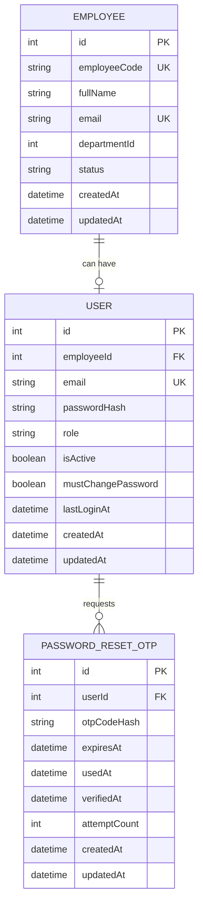
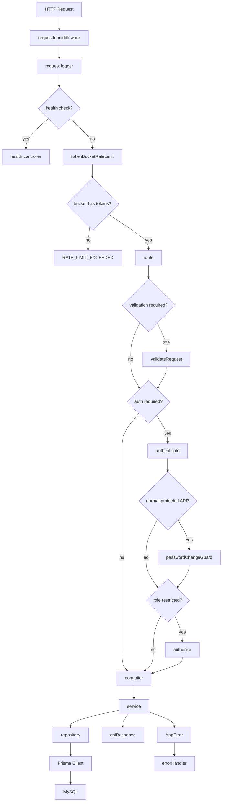
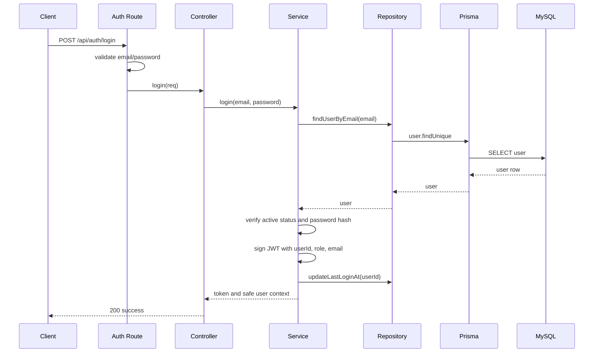
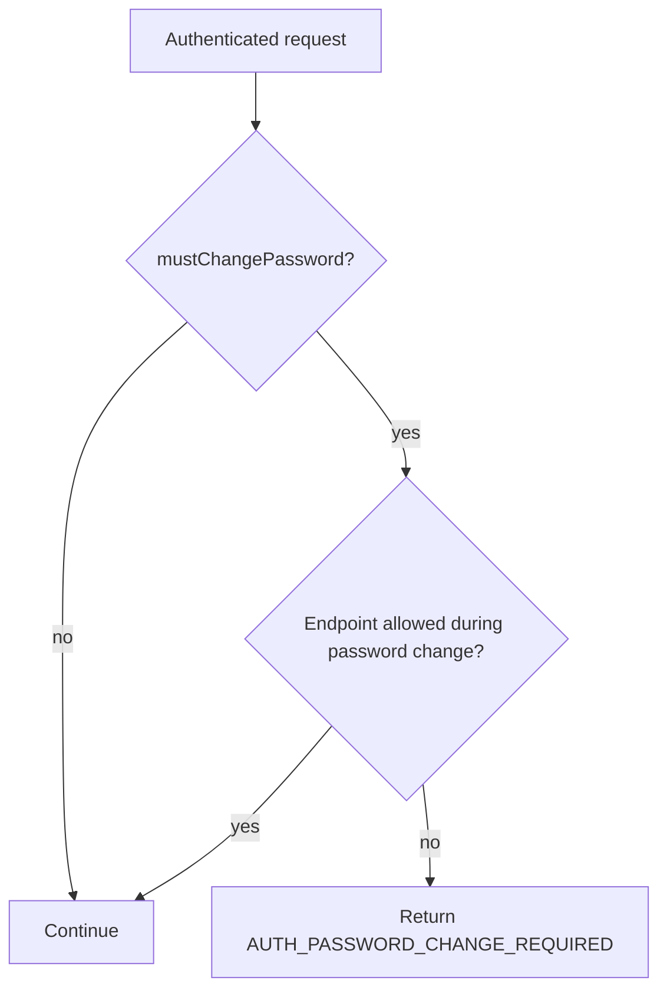
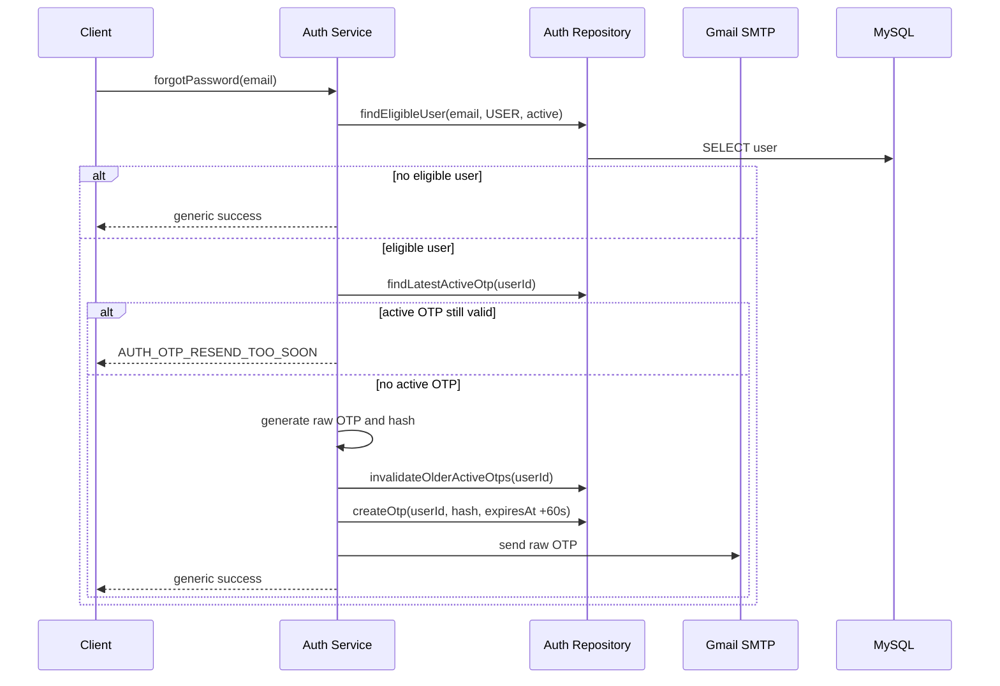
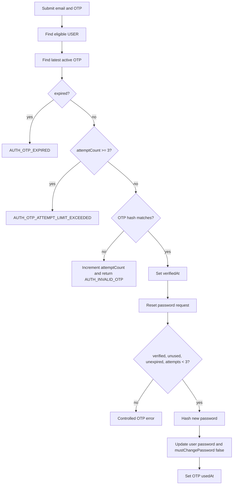

# Technical Design Document: Backend Foundation And Auth

## 1. Overview

This document defines the local-first technical design for the Enterprise Asset Management MVP backend foundation and authentication module.

The scope is the Person 1 backend deliverable: create a Node.js/Express API foundation with module-based layered architecture, Prisma/MySQL persistence, shared middleware, standard responses, centralized errors, request logging, and the `auth` module.

This TDD is based on `docs/SPEC/auth_foundation/SPEC.md` and the confirmed implementation decisions:

- Local development first; production AWS deployment is not part of this implementation scope.
- Database is MySQL through local XAMPP.
- Data access uses Prisma Client behind repository files.
- Gmail SMTP is used for OTP email delivery.
- Tests use Jest and Supertest.
- Passwords require at least 8 characters and must include letters and numbers.
- Forgot-password OTP lives for 60 seconds.
- OTP verification allows 3 failed attempts per OTP.
- OTP resend reuses `POST /api/auth/forgot-password`; creating a new OTP invalidates older active OTPs.

## 2. Requirements

### 2.1 Functional Requirements

- As a backend developer, I want an Express app foundation so that feature modules can share routing, validation, responses, errors, logging, and authentication patterns.
- As a backend developer, I want module-based layered folders so that routes, controllers, services, repositories, validators, and constants stay separated.
- As an admin, I want to create a login account for an existing employee so that the employee can access the system.
- As a user, I want to log in with company email and password so that I can access protected APIs.
- As a new user, I want to change the shared default password on first login so that my account is secure.
- As a user, I want forgot-password OTP by email so that I can reset my password.
- As a frontend developer, I want stable response formats and error codes so that auth screens can handle all expected states.
- As a backend developer, I want Jest/Supertest coverage so that the foundation can be extended by other modules safely.

### 2.2 Non-Functional Requirements

- The API must use a consistent JSON response envelope for success and error responses.
- The API must never return password hashes, raw passwords, raw OTP values, full JWT tokens in logs, or SMTP secrets.
- Protected endpoints must use JWT bearer authentication.
- Role-restricted endpoints must enforce `ADMIN` authorization in backend middleware/service logic.
- Users with `mustChangePassword = true` must be blocked from normal protected APIs by the backend, not only by frontend routing.
- All API endpoints must pass through a shared Token Bucket rate limiter to reduce brute-force, OTP abuse, and accidental request spam.
- Validation failures must return `VALIDATION_ERROR`.
- Controlled auth failures must return stable auth error codes.
- Request logs must include request ID, method, path, status code, duration, and safe user metadata when available.
- Local startup must fail clearly when critical environment variables are missing.
- Prisma schema and generated Prisma Client are part of the implementation, but the assistant must not run Prisma CLI commands.
- The implementation should remain simple enough for an internship MVP and avoid refresh tokens, token blacklist, MFA, distributed tracing, metrics dashboards, and enterprise audit storage.

## 3. Technical Design

### 3.1 Data Model Changes

The local MySQL schema is managed through Prisma. The user will run Prisma CLI commands for initialization, migration, and generation.

#### ERD



#### Prisma Model Draft

```prisma
enum UserRole {
  ADMIN
  USER
}

model Employee {
  id           Int      @id @default(autoincrement())
  employeeCode String   @unique @map("employee_code")
  fullName     String   @map("full_name")
  email        String   @unique
  departmentId Int?     @map("department_id")
  status       String   @default("ACTIVE")
  createdAt    DateTime @default(now()) @map("created_at")
  updatedAt    DateTime @updatedAt @map("updated_at")

  user User?

  @@map("employees")
}

model User {
  id                 Int      @id @default(autoincrement())
  employeeId         Int?     @unique @map("employee_id")
  email              String   @unique
  passwordHash       String   @map("password_hash")
  role               UserRole
  isActive           Boolean  @default(true) @map("is_active")
  mustChangePassword Boolean  @default(false) @map("must_change_password")
  lastLoginAt        DateTime? @map("last_login_at")
  createdAt          DateTime @default(now()) @map("created_at")
  updatedAt          DateTime @updatedAt @map("updated_at")

  employee Employee? @relation(fields: [employeeId], references: [id])
  passwordResetOtps PasswordResetOtp[]

  @@map("users")
}

model PasswordResetOtp {
  id           Int      @id @default(autoincrement())
  userId       Int      @map("user_id")
  otpCodeHash  String   @map("otp_code_hash")
  expiresAt    DateTime @map("expires_at")
  usedAt       DateTime? @map("used_at")
  verifiedAt   DateTime? @map("verified_at")
  attemptCount Int      @default(0) @map("attempt_count")
  createdAt    DateTime @default(now()) @map("created_at")
  updatedAt    DateTime @updatedAt @map("updated_at")

  user User @relation(fields: [userId], references: [id])

  @@index([userId, expiresAt])
  @@map("password_reset_otps")
}
```

#### Data Rules

- `User.email` is the login identifier.
- `User.employeeId` is nullable only to support the fixed/system-managed `ADMIN` account.
- `USER` accounts must have `employeeId`; enforce this in `auth.service`.
- An employee can have at most one user account.
- Password hashes are stored only in `User.passwordHash`.
- OTP hashes are stored only in `PasswordResetOtp.otpCodeHash`.
- A new OTP request invalidates previous active OTPs for the same user by setting `usedAt` or otherwise excluding them from active lookup.
- An OTP is active only when `usedAt` is null, `expiresAt` is in the future, and `attemptCount < 3`.
- A password reset requires the OTP to be verified, unused, unexpired, and below the failed-attempt limit.

### 3.2 API Changes

All routes mount under `/api`.

#### Standard Success Response

```json
{
  "success": true,
  "message": "Operation successful",
  "data": {}
}
```

#### Standard Error Response

```json
{
  "success": false,
  "message": "Invalid credentials",
  "errorCode": "AUTH_INVALID_CREDENTIALS",
  "requestId": "request-id-when-available"
}
```

#### Endpoint And Middleware Map

| Method | Path | Middleware Stack | Controller | Service |
| --- | --- | --- | --- | --- |
| GET | `/api/health` | requestId, logging | `healthController.check` | none |
| POST | `/api/auth/login` | requestId, logging, tokenBucketRateLimit, validate | `authController.login` | `authService.login` |
| POST | `/api/auth/logout` | requestId, logging, tokenBucketRateLimit, authenticate | `authController.logout` | `authService.logout` |
| GET | `/api/auth/me` | requestId, logging, tokenBucketRateLimit, authenticate | `authController.me` | `authService.getCurrentUser` |
| PUT | `/api/auth/change-password` | requestId, logging, tokenBucketRateLimit, authenticate, validate | `authController.changePassword` | `authService.changePassword` |
| POST | `/api/auth/forgot-password` | requestId, logging, tokenBucketRateLimit, validate | `authController.forgotPassword` | `authService.requestForgotPasswordOtp` |
| POST | `/api/auth/verify-forgot-password-otp` | requestId, logging, tokenBucketRateLimit, validate | `authController.verifyForgotPasswordOtp` | `authService.verifyForgotPasswordOtp` |
| POST | `/api/auth/reset-password` | requestId, logging, tokenBucketRateLimit, validate | `authController.resetPassword` | `authService.resetPassword` |
| POST | `/api/auth/users` | requestId, logging, tokenBucketRateLimit, authenticate, passwordChangeGuard, authorize(ADMIN), validate | `authController.createUser` | `authService.createEmployeeUser` |
| PATCH | `/api/auth/users/:id/status` | requestId, logging, tokenBucketRateLimit, authenticate, passwordChangeGuard, authorize(ADMIN), validate | `authController.updateUserStatus` | `authService.updateUserStatus` |

Normal protected routes outside the allowed first-login set must include `passwordChangeGuard`.

The shared Token Bucket rate limiter is IP-based for the local MVP. It applies to all `/api` routes except `GET /api/health` and returns the standard error envelope with `RATE_LIMIT_EXCEEDED`.

#### `GET /api/health`

Response:

```json
{
  "success": true,
  "message": "OK"
}
```

#### `POST /api/auth/login`

Request:

```json
{
  "email": "employee@company.com",
  "password": "Password123"
}
```

Response:

```json
{
  "success": true,
  "message": "Login successful",
  "data": {
    "accessToken": "jwt-token",
    "user": {
      "id": 1,
      "email": "employee@company.com",
      "role": "USER",
      "employeeId": 12,
      "mustChangePassword": true,
      "isActive": true
    }
  }
}
```

Errors:

- `VALIDATION_ERROR`
- `AUTH_INVALID_CREDENTIALS`
- `AUTH_ACCOUNT_INACTIVE`
- `RATE_LIMIT_EXCEEDED`

#### `POST /api/auth/logout`

Response:

```json
{
  "success": true,
  "message": "Logout successful"
}
```

Logout does not revoke JWTs in this MVP.

#### `GET /api/auth/me`

Response:

```json
{
  "success": true,
  "data": {
    "id": 1,
    "email": "employee@company.com",
    "role": "USER",
    "employeeId": 12,
    "mustChangePassword": false,
    "isActive": true
  }
}
```

#### `PUT /api/auth/change-password`

Request:

```json
{
  "currentPassword": "Password123",
  "newPassword": "NewPassword123",
  "confirmNewPassword": "NewPassword123"
}
```

Response:

```json
{
  "success": true,
  "message": "Password changed successfully"
}
```

Rules:

- `newPassword` must be at least 8 characters and include letters and numbers.
- `newPassword` and `confirmNewPassword` must match.
- Current password must match the existing password hash.
- On success, set `mustChangePassword` to false.

#### `POST /api/auth/forgot-password`

Request:

```json
{
  "email": "employee@company.com"
}
```

Response:

```json
{
  "success": true,
  "message": "OTP has been sent if the account is eligible"
}
```

Rules:

- Only eligible `USER` accounts receive OTP email.
- `ADMIN` accounts do not use forgot-password OTP.
- The response must not reveal whether an account exists.
- OTP expires after 60 seconds.
- Calling this endpoint again after expiry or lockout creates a new OTP.
- A new OTP invalidates older active OTPs for the same user.
- If the current OTP is still active, the service may return a controlled `AUTH_OTP_RESEND_TOO_SOON` error for known eligible users. For non-eligible or unknown emails, keep the generic success response.

#### `POST /api/auth/verify-forgot-password-otp`

Request:

```json
{
  "email": "employee@company.com",
  "otp": "123456"
}
```

Response:

```json
{
  "success": true,
  "message": "OTP verified successfully",
  "data": {
    "verified": true
  }
}
```

Rules:

- Use the latest active OTP for the user.
- Compare the raw submitted OTP against the stored OTP hash.
- On invalid OTP, increment `attemptCount`.
- After 3 failed attempts, the OTP is no longer valid.
- On success, set `verifiedAt`.

Errors:

- `VALIDATION_ERROR`
- `AUTH_INVALID_OTP`
- `AUTH_OTP_EXPIRED`
- `AUTH_OTP_ATTEMPT_LIMIT_EXCEEDED`
- `RATE_LIMIT_EXCEEDED`

#### `POST /api/auth/reset-password`

Request:

```json
{
  "email": "employee@company.com",
  "otp": "123456",
  "newPassword": "NewPassword123",
  "confirmNewPassword": "NewPassword123"
}
```

Response:

```json
{
  "success": true,
  "message": "Password reset successfully"
}
```

Rules:

- Requires a verified, unused, unexpired OTP with fewer than 3 failed attempts.
- Re-check the submitted OTP during reset.
- Hash and store the new password.
- Set `usedAt` on the OTP after successful reset.
- Set `mustChangePassword` to false after reset.

Errors:

- `AUTH_INVALID_OTP`
- `AUTH_OTP_EXPIRED`
- `AUTH_OTP_NOT_VERIFIED`
- `AUTH_OTP_ATTEMPT_LIMIT_EXCEEDED`
- `AUTH_PASSWORD_MISMATCH`
- `RATE_LIMIT_EXCEEDED`

#### `POST /api/auth/users`

Request:

```json
{
  "employeeId": 12
}
```

Response:

```json
{
  "success": true,
  "message": "User account created successfully",
  "data": {
    "id": 15,
    "employeeId": 12,
    "email": "employee@company.com",
    "role": "USER",
    "mustChangePassword": true,
    "isActive": true
  }
}
```

Rules:

- Admin-only.
- Employee must exist.
- Employee email becomes user email.
- Reject duplicate email or duplicate employee account.
- Hash `DEFAULT_USER_PASSWORD`.
- Create `USER` with `mustChangePassword = true`.

#### `PATCH /api/auth/users/:id/status`

Request:

```json
{
  "isActive": false
}
```

Response:

```json
{
  "success": true,
  "message": "User status updated successfully"
}
```

Rules:

- Admin-only.
- Updates only `isActive`.
- Does not delete user data.

#### Error Codes

Add these error codes to `shared/errors/errorCodes.js`:

- `AUTH_INVALID_CREDENTIALS`
- `AUTH_UNAUTHORIZED`
- `AUTH_FORBIDDEN`
- `AUTH_ACCOUNT_INACTIVE`
- `AUTH_PASSWORD_MISMATCH`
- `AUTH_INVALID_OTP`
- `AUTH_OTP_EXPIRED`
- `AUTH_OTP_NOT_VERIFIED`
- `AUTH_OTP_ATTEMPT_LIMIT_EXCEEDED`
- `AUTH_OTP_RESEND_TOO_SOON`
- `AUTH_PASSWORD_CHANGE_REQUIRED`
- `AUTH_USER_ALREADY_EXISTS`
- `AUTH_USER_NOT_FOUND`
- `RATE_LIMIT_EXCEEDED`
- `VALIDATION_ERROR`
- `INTERNAL_SERVER_ERROR`

### 3.3 UI Changes

No UI implementation is part of this backend TDD.

Frontend integration requires the following screens or flows:

- Login.
- First-login change password.
- Forgot-password email input.
- OTP verification.
- Reset password.
- Admin create user account from an employee record.
- Admin activate/deactivate user account.

Frontend must handle:

- `mustChangePassword` in login and `me` responses.
- `AUTH_PASSWORD_CHANGE_REQUIRED` for blocked protected APIs.
- Generic forgot-password success responses.
- OTP expiry and 3-attempt lockout messages.

### 3.4 Logic Flow

#### Request Handling Flow



#### Login Sequence



#### First-Login Password Change Guard



Allowed endpoints:

- `GET /api/auth/me`
- `PUT /api/auth/change-password`
- `POST /api/auth/logout`

#### Forgot Password OTP Sequence



#### OTP Verification And Reset



### 3.5 Dependencies

#### Runtime Dependencies

- `express`: HTTP API framework.
- `@prisma/client`: Generated Prisma Client for MySQL access.
- `bcrypt`: Password and OTP hashing.
- `jsonwebtoken`: JWT access token signing and verification.
- `nodemailer`: Gmail SMTP OTP email delivery.
- `zod` or `joi`: Request validation. Prefer `zod` for concise schemas.
- `dotenv`: Local `.env` loading.
- `cors`: Frontend integration during local development.
- `helmet`: Basic HTTP security headers.
- `pino` or `winston`: Structured logs. Prefer `pino` for simple JSON logs.
- `uuid`: Request ID generation when `X-Request-Id` is not provided.

#### Development Dependencies

- `prisma`: Prisma CLI package. The user runs Prisma CLI commands.
- `jest`: Unit test runner.
- `supertest`: Express API integration tests.
- `nodemon`: Local development restart.
- `eslint` and `prettier`: Code quality and formatting if the project chooses to add them.

#### Environment Variables

`.env.example` must include:

```text
PORT=5000
NODE_ENV=development
DATABASE_URL="mysql://root:@localhost:3306/enterprise_asset_management"
JWT_SECRET="replace-with-local-secret"
JWT_EXPIRES_IN="1h"
DEFAULT_USER_PASSWORD="Password123"
OTP_EXPIRES_SECONDS=60
OTP_MAX_ATTEMPTS=3
RATE_LIMIT_BUCKET_CAPACITY=60
RATE_LIMIT_REFILL_TOKENS_PER_SECOND=1
RATE_LIMIT_TOKENS_PER_REQUEST=1
MAIL_HOST="smtp.gmail.com"
MAIL_PORT=587
MAIL_SECURE=false
MAIL_USER="your-gmail-address@gmail.com"
MAIL_PASSWORD="your-gmail-app-password"
MAIL_FROM="your-gmail-address@gmail.com"
```

Notes:

- Prefer `DATABASE_URL` for Prisma instead of separate `DB_HOST`, `DB_PORT`, `DB_USER`, `DB_PASSWORD`, and `DB_NAME`.
- Do not commit real `.env` values.
- Gmail should use an app password, not the normal Gmail account password.

### 3.6 Security Considerations

- Hash all passwords with bcrypt before storage.
- Hash OTP values before storage when feasible.
- JWT payload must include only `userId`, `role`, and `email`.
- `authenticate` must reject missing, malformed, invalid, and expired JWTs.
- `authorize` must reject users without the required role.
- `passwordChangeGuard` must run on normal protected routes.
- `forgot-password` must not leak whether an email exists for unknown or ineligible users.
- Apply the shared Token Bucket rate limiter before validation, authentication, and controller logic for all non-health API routes.
- Raw password, raw OTP, full JWT token, SMTP credentials, and database secrets must never be logged.
- `DEFAULT_USER_PASSWORD` must be changed by users on first login.
- `ADMIN` forgot-password OTP is out of scope.
- Account status updates should deactivate login without deleting data.
- Validate all request payloads before controller logic.
- Enforce payload size limits in Express.
- Use `helmet` and CORS configuration appropriate for local frontend origin.

#### Token Bucket Rate Limit Policy

Use a shared Token Bucket middleware with the standard API error envelope:

```json
{
  "success": false,
  "message": "Too many requests. Please try again later.",
  "errorCode": "RATE_LIMIT_EXCEEDED",
  "requestId": "request-id-when-available"
}
```

Local MVP behavior:

- Bucket key: client IP address.
- Bucket storage: in-memory `Map` for local development.
- Scope: all `/api` endpoints except `GET /api/health`.
- Capacity: `RATE_LIMIT_BUCKET_CAPACITY`, default `60`.
- Refill rate: `RATE_LIMIT_REFILL_TOKENS_PER_SECOND`, default `1`.
- Cost per request: `RATE_LIMIT_TOKENS_PER_REQUEST`, default `1`.
- When the bucket has enough tokens, consume request tokens and continue.
- When the bucket does not have enough tokens, return `RATE_LIMIT_EXCEEDED`.
- Include a `Retry-After` header when possible, calculated from missing tokens and refill rate.
- Clean up stale buckets periodically to avoid unbounded memory growth during long local sessions.

Algorithm:

```text
bucket = buckets[ip] or { tokens: capacity, lastRefillAt: now }
elapsedSeconds = (now - bucket.lastRefillAt) / 1000
refilledTokens = elapsedSeconds * refillTokensPerSecond
bucket.tokens = min(capacity, bucket.tokens + refilledTokens)
bucket.lastRefillAt = now

if bucket.tokens < tokensPerRequest:
  retryAfterSeconds = ceil((tokensPerRequest - bucket.tokens) / refillTokensPerSecond)
  return RATE_LIMIT_EXCEEDED with Retry-After

bucket.tokens = bucket.tokens - tokensPerRequest
continue
```

For local/demo scope, IP-based in-memory buckets are enough. For multi-instance deployment, replace in-memory bucket storage with Redis or another shared store.

### 3.7 Performance And Reliability Considerations

- Use Prisma repository methods to avoid duplicated queries and keep service logic readable.
- Add indexes on `User.email`, `User.employeeId`, `Employee.email`, and `PasswordResetOtp.userId/expiresAt`.
- Keep JWT stateless for MVP simplicity.
- Gmail SMTP failures should return controlled backend errors for eligible users and safe logs for debugging.
- OTP expiry is short, so frontend should guide users to request a new OTP after 60 seconds.
- OTP resend is intentionally implemented by calling `forgot-password` again, avoiding another endpoint.
- Token Bucket rate limiting protects the whole API from accidental spam and simple brute-force attempts without adding Redis or background infrastructure for local development.
- For local-first MVP, no Redis, queue, background worker, or token blacklist is required.

### 3.8 Observability And Operations

#### Request Observability

- Add `requestId` middleware before routes.
- Use client `X-Request-Id` when present.
- Generate a UUID request ID when absent.
- Attach `requestId` to `req`.
- Include `requestId` in logs and controlled error responses.
- Log request method, path, response status, duration, and safe user metadata when available.

#### Startup And Readiness

- Validate critical environment variables during startup.
- Log server startup with port and `NODE_ENV`.
- Verify Prisma can connect during startup or first health diagnostic depending on implementation simplicity.
- `GET /api/health` remains the basic local readiness check.

#### Auth Operation Logs

Log safe metadata for:

- Login success and failure.
- Logout.
- Admin-created user account.
- User status change.
- Password change success.
- Forgot-password OTP requested.
- OTP send success/failure.
- Token Bucket rate limit rejection for API endpoints.
- OTP verification success/failure.
- Password reset success.
- Password-change-required API rejection.

Out of scope:

- Metrics dashboard.
- Alerting.
- Distributed tracing.
- Centralized logs.
- Enterprise audit log storage.

## 4. Testing Plan

Use Jest for unit tests and Supertest for Express route tests.

### 4.1 Unit Tests

- `password.util`: hashes and verifies passwords.
- `otp.util`: generates six-digit OTPs, hashes OTPs, verifies OTPs, and computes 60-second expiry.
- `token.util`: signs and verifies JWT payloads with `userId`, `role`, and `email`.
- `date.util`: checks expiry boundaries.
- `auth.service.login`: success, invalid email/password, inactive account.
- `auth.service.changePassword`: current password mismatch, confirmation mismatch, successful password update.
- `auth.service.requestForgotPasswordOtp`: eligible user, unknown email generic success, admin ignored/generic path, active OTP resend-too-soon path.
- `auth.service.verifyForgotPasswordOtp`: valid OTP, invalid OTP increments attempts, expired OTP, attempt limit after 3 failures.
- `auth.service.resetPassword`: requires verified OTP, rejects expired/used OTP, updates password, marks OTP used.
- `passwordChangeGuard`: allows only `me`, `change-password`, and `logout` while password change is required.
- Token Bucket rate limit middleware refills tokens over time, consumes tokens per request, returns `RATE_LIMIT_EXCEEDED` using the standard error envelope, and sets `Retry-After` when the bucket is empty.

### 4.2 API Tests With Supertest

- `GET /api/health` returns success.
- `POST /api/auth/login` validates payload.
- API endpoints return `RATE_LIMIT_EXCEEDED` after the shared Token Bucket is exhausted.
- `POST /api/auth/login` returns JWT and safe user context.
- `GET /api/auth/me` rejects missing token.
- `GET /api/auth/me` returns current user context with valid token.
- `PUT /api/auth/change-password` changes password and clears `mustChangePassword`.
- `POST /api/auth/users` rejects non-admin users.
- `POST /api/auth/users` creates a `USER` from an employee for admin users.
- `PATCH /api/auth/users/:id/status` updates `isActive`.
- `POST /api/auth/forgot-password` returns generic success for unknown email.
- `GET /api/health` is not blocked by the Token Bucket limiter.
- `POST /api/auth/verify-forgot-password-otp` verifies valid OTP.
- `POST /api/auth/reset-password` rejects unverified OTP.
- `POST /api/auth/reset-password` resets password with verified OTP.
- Normal protected test route returns `AUTH_PASSWORD_CHANGE_REQUIRED` when `mustChangePassword = true`.

### 4.3 Integration Notes

- Mock Gmail SMTP in automated tests.
- Mock or isolate Prisma with a test database strategy chosen during implementation.
- Do not require real Gmail credentials in CI or local automated tests.
- Seed minimum test data:
  - One fixed `ADMIN`.
  - One employee without a user account.
  - One employee with a `USER` account.
  - One `USER` with `mustChangePassword = true`.
  - One active `USER` with normal login.

### 4.4 Handoff Validation

- Frontend can log in and read `accessToken`.
- Frontend can read `mustChangePassword`.
- Frontend can attach `Authorization: Bearer <accessToken>`.
- Frontend can handle `AUTH_PASSWORD_CHANGE_REQUIRED`.
- Frontend can run forgot-password flow: `forgot-password -> verify-forgot-password-otp -> reset-password`.
- Backend members can create a new module using the same folder and layer pattern.

## 5. Open Questions

- Confirm whether the backend will use JavaScript or TypeScript before implementation. The current SPEC uses `.js` paths, so JavaScript is assumed unless changed.
- Confirm exact local frontend origin for CORS once the frontend dev server is known.
- Confirm whether `AUTH_OTP_RESEND_TOO_SOON` should be exposed to eligible users or whether all resend-too-soon cases should return generic success for simpler frontend behavior.
- Confirm whether the first `ADMIN` account is created by seed script, manual database insert, or a one-time setup script. The user will run all DB and Prisma commands.

## 6. Alternatives Considered

### Separate `resend-otp` Endpoint

Rejected for MVP. Reusing `POST /api/auth/forgot-password` keeps the contract smaller and matches the current SPEC. The service can distinguish active OTP, expired OTP, and lockout internally.

### Raw SQL Or `mysql2`

Rejected because the user chose Prisma. Repositories will still isolate data access so other modules do not depend directly on Prisma query details.

### Token Blacklist For Logout

Rejected for MVP. Logout is a frontend token removal event plus safe backend log. Refresh tokens, token blacklist, and session revocation remain future scope.

### Fixed-Window Or Endpoint-Specific Rate Limiters

Rejected because the chosen design is a shared system-wide Token Bucket limiter. Token Bucket handles short bursts better than a fixed window while still enforcing a steady refill rate, and a single middleware keeps the foundation consistent for future modules.

### Redis For OTP

Rejected for local-first MVP. OTP state is stored in MySQL through Prisma so it remains simple and visible during local development.

### Production AWS Design In This TDD

Rejected for current scope. The backend should remain compatible with later AWS/RDS deployment, but this TDD targets local implementation first.
